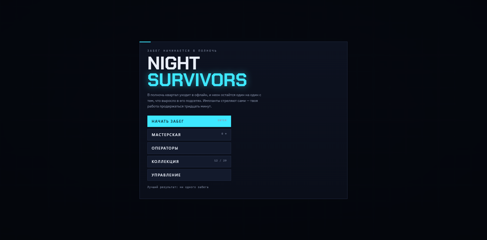

# Night survivors

Survivors-like на HTML5 в неоновом киберпанк-сеттинге. Оружие и импланты стреляют автоматически;
игрок управляет движением, выбирает апгрейды и решает, когда применять активный навык.
Цель забега — продержаться пятнадцать минут.

**▶ [Играть в браузере](https://maybenextimeee.github.io/Night_survivors/)**

Игра написана на чистом JavaScript и Canvas 2D без движков, библиотек и графических файлов:
вся графика рисуется кодом, звук и музыка синтезируются через WebAudio. Результат сборки —
один самодостаточный `index.html`, который работает и с сервера, и с диска.



## Платформы и управление

Поддерживаются компьютер (клавиатура и мышь) и сенсорные устройства в обеих ориентациях.
Сенсорный режим включается автоматически: по первому касанию, по характеристикам экрана
или по типу устройства из SDK Яндекс Игр. Нажатие физической клавиши возвращает режим компьютера.

| Действие | Клавиатура и мышь | Сенсорный экран |
|---|---|---|
| Движение | `W` `A` `S` `D` / стрелки, инерционное, в любом направлении | плавающий джойстик в точке касания |
| Активный навык | `ЛКМ` или `Q` — в сторону курсора | кнопка навыка — в ближайшего врага |
| Ульта (все три заряда) | `ПКМ` или `E` | золотая кнопка, активна при трёх зарядах |
| Рывок | `Пробел` | кнопка рывка |
| Выбор карты | `1` `2` `3` или клик | касание карты |
| Переброс карт | `R` | кнопка «Переброс» |
| Пауза | `Esc` | кнопка `II` |
| Звук | `M` | — |

Клавиши считываются по физическому положению (`KeyboardEvent.code`), поэтому управление не зависит
от раскладки.

Интерфейс переведён на русский и английский. Язык определяется автоматически (на Яндекс Играх —
по языку портала, иначе по языку браузера); в главном меню есть ручной переключатель.

## Игровой процесс

**Забег.** Перед стартом выбираются арена и активный навык. Враги рассыпаются на кристаллы опыта;
за каждый уровень предлагаются три карты: новое оружие, прокачка имеющегося, имплант или усиление навыка.
Слотов — 4 под оружие и 6 под импланты.

**Навык и ульта.** Навык копит до трёх зарядов. Заряды тратятся по одному или все сразу на ульту.
Убийства навыком возвращают часть заряда и дают кратковременный разгон. Урон ульты растёт
с уровнем персонажа: +2% за уровень, не выше ×2.5.

**Эволюции и сундуки.** Оружие, прокачанное до максимума, вместе с нужным имплантом превращается
в эволюцию при подборе сундука. Сундуки приходят по расписанию: первый на 00:45, далее каждые
45 секунд, после 10:00 — каждые 25. Каждый четвёртый сундук золотой и даёт несколько апгрейдов.

**Арены.** Три арены со своими врагами, боссами, палитрой, музыкой и множителем сложности.
Каждая следующая открывается прохождением предыдущей.

| Арена | Сложность | Боссы (4:00 · 8:00 · 12:00) | 15:00 |
|---|---|---|---|
| Неоновый квартал | ×1.00 | Надзиратель · Пожиратель · Полночь | Жнец |
| Литейный цех | ×1.35 | Доменная · Ковшевой · Разливщик | Жнец |
| Ядро сети | ×1.80 | Брандмауэр · Демон сети · Архивариус | Первоисточник |

Множитель арены применяется к здоровью врагов целиком, к урону — с коэффициентом 0.55.
На 15:00 забег засчитывается. На первых двух аренах приходит Жнец, убивающий с одного касания;
на третьей — финальный босс Первоисточник, после победы над которым забег продолжается кругами.

**Модификаторы арен** (доступны на пройденной арене, совместимы между собой):

| Модификатор | Эффект | Добыча |
|---|---|---|
| Гипер | здоровье врагов ×1.7, урон ×1.35, скорость ×1.08, плотность ×1.2, +3.5 п. п. к шансу элиты | ×2 |
| Бесконечность | Жнеца нет; каждые 15 минут новый круг: расписание боссов повторяется, враги ×1.45 по здоровью и ×1.16 по урону за круг | ×1.35 + 0.3 за круг |

**Смерть и воскрешение.** Улучшение «Резервная копия» поднимает один раз за забег. На Яндекс Играх
дополнительно доступно воскрешение за просмотр рекламы — один раз за забег.

**Прогрессия между забегами.** Осколки, заработанные в забеге, тратятся в мастерской на постоянные
улучшения. Контент открывается по условиям (время, убийства, неонки, боссы, сундуки). Есть 30 достижений
четырёх редкостей и личные рекорды бесконечного режима; на Яндекс Играх — общая таблица рекордов.

## Содержимое

| | Количество |
|---|---|
| Оружие | 11 базовых + 11 эволюций |
| Импланты | 12 |
| Операторы | 6 |
| Активные навыки | 3, у каждого своя ульта |
| Улучшения мастерской | 18 |
| Арены | 3 |
| Модификаторы арен | 2 |
| Враги | 14 типов, 10 боссов и Жнец |
| Достижения | 30 |
| Условия открытия | 15 |

## Архитектура

Исходники лежат в `src/` и склеиваются скриптом `build.ps1` в один HTML-файл. Все JS-модули
выполняются как один скрипт, поэтому порядок файлов в сборке важен.

```
index.html                    собранная игра для GitHub Pages и запуска с диска
build.ps1                     сборка: index.html и build/ для Яндекс Игр
CHANGELOG.md                  история версий
src/
  00-shell.html               разметка интерфейса и все стили
  01-engine.js                утилиты, звук и музыка, сохранения, ввод, пространственная сетка,
                              версия игры и значения удалённой конфигурации по умолчанию
  02-content.js               данные: оружие, импланты, навыки, враги, боссы, арены, модификаторы,
                              мастерская, открытия, достижения, операторы
  03-game.js                  состояние забега, игровой цикл, бой, спавн, сундуки, уровни,
                              задания, открытия, достижения, конец забега
  04-render.js                отрисовка мира на Canvas 2D
  05-ui.js                    экраны, HUD, меню, таблица рекордов, главный цикл кадра
  06-platform.js              SDK Яндекс Игр: облако, вход, рекорды, реклама, флаги, пауза, фокус
  07-touch.js                 сенсорное управление: джойстик, кнопки, автоприцел
  08-i18n.js                  локализация: функция t(), словари интерфейса и контента
  09-boot.js                  порядок запуска
docs/
  screenshot.png              скриншот для README
  store-listing.md            тексты карточки игры в каталоге (RU и EN)
  promo-prompts.txt           промпты для генерации иконки и обложек
.github/workflows/deploy.yml  сборка на каждый пуш, публикация на Pages, архив для Яндекса
```

### Сборка

`./build.ps1` создаёт две версии игры из одних исходников:

| Результат | Назначение | Отличие |
|---|---|---|
| `index.html` | GitHub Pages, запуск с диска | без SDK |
| `build/yandex/index.html`, `build/night-survivors-yandex.zip` | Консоль Яндекс Игр | с тегом `/sdk.js` в `<head>` |

Переводы строк приводятся к LF, чтобы собранный файл совпадал с версией в git. Папка `build/`
в репозиторий не входит. GitHub Actions на каждый пуш собирает игру, публикует `index.html`
на Pages и сохраняет `build/yandex/` как артефакт `night-survivors-yandex` на 90 дней.

### Ключевые решения

- **Производительность.** Потолок — 340 врагов одновременно. Соседи и расталкивание ищутся через
  равномерную сетку, а не перебором пар. Свечение рисуется заранее подготовленными спрайтами
  вместо `shadowBlur`.
- **Урон.** Весь урон проходит через одну функцию `damageEnemy`: там же применяются бонус по боссам
  и критический удар, поэтому эти эффекты работают для любого источника.
- **Платформа.** Всё, что зависит от SDK, собрано в `06-platform.js`. Без SDK каждый метод
  деградирует тихо: сохранение только локальное, рекорды личные, реклама и флаги не используются.
- **Ввод.** Сенсорные кнопки выставляют те же виртуальные клавиши, что и клавиатура, поэтому
  игровая логика одна для обоих способов управления. Отличается только прицел навыка.
- **Локализация.** Русский — исходный язык в коде. Английский накладывается поверх: строки интерфейса
  проходят через `t("русская строка")`, поля контента подменяются на месте с сохранением оригиналов,
  статичная разметка переводится обходом текстовых узлов. Переключение работает без перезагрузки.
- **Раскладка.** Интерфейс адаптируется от 360×640 до 1920×1080: на узких экранах карты и списки
  выстраиваются в колонку, полоса опыта переносится под часы, длинные экраны прокручиваются внутри
  игры с закреплёнными кнопками.

## Сохранения

Прогресс хранится в `localStorage` под ключом `nightshift.save.v1`. На Яндекс Играх он дублируется
в облако через `player.setData` (с задержкой 4 секунды из-за лимита 100 записей за 5 минут; конец забега
и уход со вкладки записываются сразу). При запуске локальная и облачная версии сравниваются по
заработанным за всё время осколкам, затем по числу забегов, затем по номеру правки `rev`.

## Интеграция с Яндекс Играми

| Возможность SDK | Использование |
|---|---|
| `LoadingAPI.ready` | один раз, когда меню готово к работе |
| `GameplayAPI.start/stop` | забег и выбор карты — геймплей; меню, пауза, итоги — нет |
| `game_api_pause/resume` | заморозка мира и звука |
| `player.getData/setData` | облачное сохранение |
| `auth.openAuthDialog` | вход по кнопке в главном меню |
| `leaderboards` | рекорды бесконечного режима |
| `adv.showFullscreenAdv` | между забегами, по кнопкам «Ещё раз» и «В меню» |
| `adv.showRewardedVideo` | дополнительные осколки на экране итогов; воскрешение раз за забег |
| `getFlags` | удалённая конфигурация |
| `environment.i18n.lang`, `deviceInfo` | язык и тип устройства |

**Лидерборды** (тип «время», сортировка по убыванию, результат в миллисекундах):
`endlessQuarter`, `endlessFoundry`, `endlessCore`.

**Флаги удалённой конфигурации.** Значения приходят строками, проверяются и ограничиваются
допустимым диапазоном; некорректные значения игнорируются.

| Флаг | По умолчанию | Диапазон | Назначение |
|---|---|---|---|
| `xp_mul` | 1 | 0.25–4 | множитель опыта |
| `shard_mul` | 1 | 0.25–5 | множитель осколков за забег |
| `enemy_hp_mul` | 1 | 0.25–4 | множитель здоровья врагов |
| `enemy_dmg_mul` | 1 | 0.25–4 | множитель урона врагов |
| `chest_every` | 45 | 15–120 | интервал сундуков до 10:00, секунды |
| `reward_mul` | 1 | 0–5 | награда за рекламу в долях итога забега |
| `ad_between_runs` | 1 | 0 / 1 | полноэкранная реклама между забегами |
| `ad_revive` | 1 | 0 / 1 | воскрешение за рекламу |
| `revive_hp` | 0.5 | 0.1–1 | доля здоровья после воскрешения |
| `news` | — | до 100 символов | строка-объявление в главном меню |

## Версии

Текущая версия задаётся константой `GAME_VERSION` в `src/01-engine.js` и отображается в правом
нижнем углу меню. История изменений — в [CHANGELOG.md](CHANGELOG.md).
